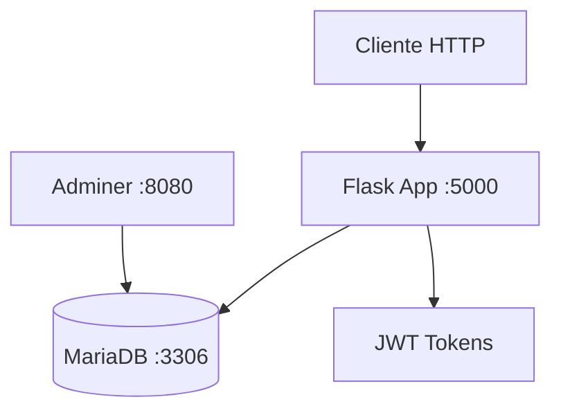
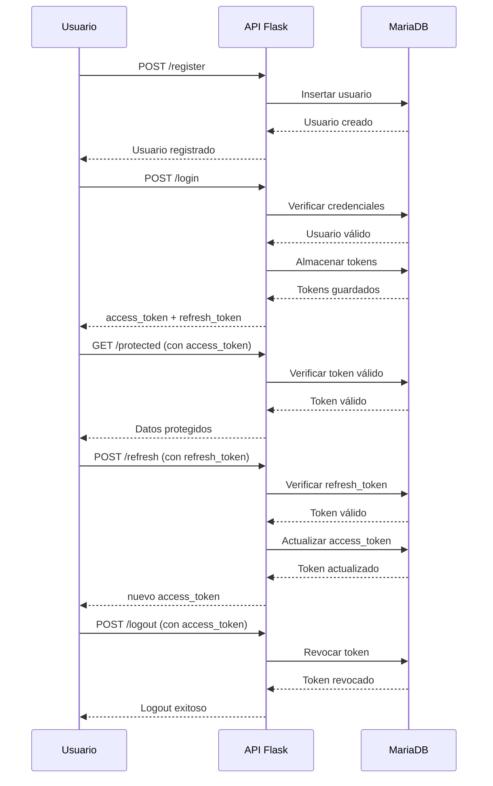

# Microservicio JWT

## Descripción

Este proyecto es un microservicio de autenticación basado en JSON Web Tokens (JWT) desarrollado con Flask y Python. Proporciona una API REST completa para gestionar la autenticación de usuarios, incluyendo registro, login, refresh de tokens, logout y acceso a recursos protegidos. Utiliza MariaDB como base de datos y está completamente dockerizado para facilitar el despliegue.

## Características

- ✅ Registro de usuarios con validación
- ✅ Autenticación segura con JWT
- ✅ Sistema de refresh tokens
- ✅ Revocación de tokens en logout
- ✅ Endpoint protegido para recursos autenticados
- ✅ Health check del servicio
- ✅ Base de datos MariaDB con configuración UTF-8
- ✅ Dockerización completa con Docker Compose
- ✅ Logging detallado para debugging
- ✅ Adminer incluido para gestión de BD
- ✅ Script de pruebas automatizadas

## Arquitectura



### Componentes

- **Flask App**: API REST principal que maneja todas las operaciones de autenticación
- **MariaDB**: Base de datos relacional para almacenar usuarios y tokens
- **Adminer**: Interfaz web para gestión y consulta de la base de datos
- **JWT**: Sistema de tokens para autenticación stateless

## Flujo de Autenticación JWT



## Prerrequisitos

- Docker (versión 20.10 o superior)
- Docker Compose (versión 1.29 o superior)
- Puerto 5000 disponible (API)
- Puerto 3306 disponible (MariaDB)
- Puerto 8080 disponible (Adminer)

## Instalación

1. **Clona el repositorio**
   ```bash
   git clone <url-del-repositorio>
   cd jwt-microservice
   ```

2. **Configura las variables de entorno**
   ```bash
   cp .env.example .env  # Si existe, o crea .env con las variables
   ```

3. **Construye y ejecuta los contenedores**
   ```bash
   docker-compose up --build
   ```

4. **Verifica que los servicios estén corriendo**
   - API: http://localhost:5000/health
   - Adminer: http://localhost:8080

## Configuración

### Variables de Entorno (.env)

```env
# Configuración de Base de Datos
DB_HOST=mariadb
DB_PORT=3306
DB_USER=jwt_user
DB_PASSWORD=jwt_password
DB_NAME=jwt_auth

# Configuración JWT
JWT_SECRET_KEY=UDEM
ACCESS_TOKEN_EXPIRES_MINUTES=15
REFRESH_TOKEN_EXPIRES_DAYS=7
```

### Descripción de Variables

- **DB_HOST**: Host de la base de datos (por defecto: mariadb)
- **DB_PORT**: Puerto de la base de datos (por defecto: 3306)
- **DB_USER**: Usuario de la base de datos
- **DB_PASSWORD**: Contraseña del usuario
- **DB_NAME**: Nombre de la base de datos
- **JWT_SECRET_KEY**: Clave secreta para firmar los tokens JWT
- **ACCESS_TOKEN_EXPIRES_MINUTES**: Tiempo de expiración del access token en minutos
- **REFRESH_TOKEN_EXPIRES_DAYS**: Tiempo de expiración del refresh token en días

## Uso

### Acceso a los Servicios

- **API del Microservicio**: http://localhost:5000
- **Adminer (Gestión BD)**: http://localhost:8080
  - Usuario: jwt_user
  - Contraseña: jwt_password
  - Base de datos: jwt_auth

### Endpoints de la API

#### 1. Registro de Usuario
**POST** `/register`

Registra un nuevo usuario en el sistema.

**Request Body:**
```json
{
  "username": "usuario_ejemplo",
  "email": "usuario@example.com",
  "password": "contraseña_segura"
}
```

**Response (201):**
```json
{
  "message": "User registered successfully",
  "user_id": 1
}
```

#### 2. Login
**POST** `/login`

Autentica al usuario y devuelve tokens JWT.

**Request Body:**
```json
{
  "username": "usuario_ejemplo",
  "password": "contraseña_segura"
}
```

**Response (200):**
```json
{
  "access_token": "eyJ0eXAiOiJKV1QiLCJhbGciOiJIUzI1NiJ9...",
  "refresh_token": "eyJ0eXAiOiJKV1QiLCJhbGciOiJIUzI1NiJ9...",
  "token_type": "Bearer",
  "expires_in": 900,
  "message": "Login successful"
}
```

#### 3. Refresh Token
**POST** `/refresh`

Renueva el access token usando el refresh token.

**Request Body:**
```json
{
  "refresh_token": "eyJ0eXAiOiJKV1QiLCJhbGciOiJIUzI1NiJ9..."
}
```

**Response (200):**
```json
{
  "access_token": "eyJ0eXAiOiJKV1QiLCJhbGciOiJIUzI1NiJ9...",
  "token_type": "Bearer",
  "expires_in": 900,
  "message": "Token refreshed successfully"
}
```

#### 4. Logout
**POST** `/logout`

Revoca el token actual del usuario.

**Headers:**
```
Authorization: Bearer <access_token>
```

**Response (200):**
```json
{
  "message": "Logged out successfully"
}
```

#### 5. Endpoint Protegido
**GET** `/protected`

Accede a recursos que requieren autenticación.

**Headers:**
```
Authorization: Bearer <access_token>
```

**Response (200):**
```json
{
  "message": "This is a protected endpoint",
  "user_id": 1,
  "data": "Secret data only for authenticated users"
}
```

#### 6. Health Check
**GET** `/health`

Verifica el estado del servicio y la conexión a la base de datos.

**Response (200):**
```json
{
  "status": "healthy",
  "database": "connected",
  "tables": ["users", "tokens"],
  "timestamp": "2024-01-01T12:00:00.000000"
}
```

## Pruebas

El proyecto incluye un script de pruebas automatizadas que verifica todas las funcionalidades.

### Ejecutar Pruebas

```bash
# Asegúrate de que los servicios estén corriendo
python test_jwt.py
```

### Qué Prueba el Script

- ✅ Salud del servicio
- ✅ Registro de usuario
- ✅ Login exitoso
- ✅ Acceso a endpoint protegido
- ✅ Refresh de token
- ✅ Logout y revocación
- ✅ Verificación de que el token fue revocado

### Pruebas Manuales

También puedes usar herramientas como Postman o curl. Consulta el archivo `commands-tests.txt` para ejemplos detallados de requests.

## Despliegue en Producción

### Consideraciones de Seguridad

1. **Cambia la JWT_SECRET_KEY** por una clave segura y única
2. **Usa HTTPS** en producción
3. **Configura contraseñas fuertes** para la base de datos
4. **Implementa rate limiting** para prevenir ataques de fuerza bruta
5. **Monitorea logs** para detectar actividades sospechosas

### Variables de Producción

```env
JWT_SECRET_KEY=tu_clave_secreta_muy_segura_aqui
DB_PASSWORD=contraseña_muy_segura
```

### Comando de Despliegue

```bash
docker-compose -f docker-compose.yml up -d --build
```

## Estructura del Proyecto

```
jwt-microservice/
├── app.py                 # Aplicación Flask principal
├── test_jwt.py           # Script de pruebas
├── commands-tests.txt    # Ejemplos de requests para Postman
├── requirements.txt      # Dependencias Python
├── Dockerfile           # Dockerfile para la app
├── Dockerfile.mariadb   # Dockerfile para MariaDB
├── docker-compose.yml   # Configuración Docker Compose
├── init.sql            # Script de inicialización BD
├── .env                # Variables de entorno
└── README.md           # Este archivo
```

## Tecnologías Utilizadas

- **Flask**: Framework web para Python
- **PyJWT**: Librería para manejo de JWT
- **PyMySQL**: Conector MySQL para Python
- **MariaDB**: Base de datos relacional
- **Docker**: Contenedorización
- **Adminer**: Interfaz web para bases de datos

¡El microservicio JWT está listo para usar! 🚀
